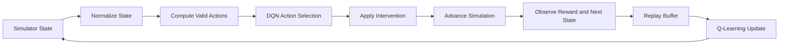

# Reinforcement Learning for Epidemic Control

A deep reinforcement learning project for learning adaptive public-health intervention policies inside a large-scale, agent-based COVID-19 simulator.

The simulator models **10,000 individuals** connected through a social network and includes heterogeneous behavior, infection dynamics, economic decisions, vaccine research, vaccine distribution, and dynamically constrained policy actions.

The final early-stopped Deep Q-Network reduced average infections by approximately **43%** compared with a random-action policy.

---

## Overview

Traditional epidemic models often use simplified compartmental systems such as SIR or SEIR. This project instead uses an agent-based environment in which each individual has distinct behavioral and biological characteristics.

A reinforcement learning agent acts as a local public-health authority. At each decision point, it selects interventions such as:

- Awareness campaigns
- Community mobility restrictions
- Individual financial support
- Treasury investments
- Vaccine research funding
- Vaccine production acceleration
- Random or referral-based vaccine allocation

The agent must control infections while operating under uncertainty, delayed rewards, limited resources, and changing action constraints.

---

## Key Results

The final model was evaluated over **250 simulations**.

| Policy | Scenario | Average Infections | Standard Deviation | Pandemic Length |
|---|---|---:|---:|---:|
| Final RL Model | All simulations | **2,160.64** | 825.91 | 41.38 |
| Final RL Model | Outbreaks only (>100 infections) | **2,388.15** | 464.05 | 44.47 |
| Random Policy | All simulations | 3,758.58 | 1,377.36 | 36.66 |
| Random Policy | Outbreaks only (>100 infections) | 4,231.24 | 376.28 | 39.99 |

The learned policy:

- Reduced average infections by about **42.5%** relative to random action selection
- Produced lower-variance outcomes
- Learned multi-stage intervention strategies
- Slightly increased epidemic duration while reducing total infections, resembling a “flatten the curve” strategy
- Performed best when training was stopped early, before later policy degradation

---

## Simulator

### Social Network

The population is represented as a Barabási–Albert preferential-attachment network. Each node represents an individual, and each edge represents a possible transmission path.

### Infection Dynamics

Transmission probability depends on several biological and behavioral factors:

\[
P =
b_p
\cdot r_{\text{susceptible}}
\cdot r_{\text{infected}}
\cdot q_{\text{susceptible}}
\cdot q_{\text{infected}}
\cdot s_{\text{infected}}
\cdot k_{\text{infected}}
\]

where:

- \(b_p\) is the baseline biological transmission probability
- \(r\) represents risk tolerance
- \(q\) represents adherence to restrictions
- \(s\) represents symptomatic severity
- \(k\) represents superspreading potential

Individuals remain contagious for five simulated days before transitioning to a removed state.

### Environment Characteristics

The simulator includes:

- 10,000 heterogeneous agents
- Community structure and localized outbreaks
- Stochastic infection transmission
- Economic constraints
- Delayed vaccine approval
- Vaccine research and production
- Individual vaccine acceptance
- Partial observability
- Dynamic action legality

---

## Reinforcement Learning Formulation

The problem is modeled as a Markov Decision Process:

\[
(S, A, P, r, \gamma)
\]

where:

- \(S\): simulator state
- \(A\): public-health intervention actions
- \(P\): stochastic transition dynamics
- \(r\): reward based primarily on new infections
- \(\gamma\): discount factor

### State Representation

The state vector includes:

- Active infections
- Cumulative infections
- Daily new infections
- Per-community infection counts
- Treasury balance
- Pending payouts and spending constraints
- Vaccine approval progress
- Available vaccine doses
- Research and production status
- Aggregate risk tolerance
- Mitigation influence
- Restriction adherence

Input states are normalized with a `MinMaxScaler` fitted on initial random simulations.

### Action Masking

Not every action is legal in every state. For example:

- Vaccines cannot be administered before approval
- Actions cannot exceed available funds
- Some interventions depend on current epidemic conditions

A validity mask prevents the agent from selecting illegal actions while preserving a fixed discrete action space.

---

## Deep Q-Network

The final model uses:

- Two fully connected hidden layers
- Hidden sizes: `256` and `128`
- `LeakyReLU` activations
- Linear output layer over the discrete action space
- Adam optimizer
- Learning rate: `3e-5`
- Discount factor: `0.97`
- Batch size: `256`
- Replay-buffer capacity: `20,000`
- Epsilon-greedy exploration
- Multiplicative epsilon decay: `0.997`
- Evaluation-based early stopping

### Training Loop



Rewards are based on a scaled negative value of new infections. This encourages the agent to suppress or delay transmission.

---

## Model Development

Five model variants were explored.

| Model | Main Changes | Outcome |
|---|---|---|
| Model 1 | Initial simulator-agent pipeline | Did not beat the random baseline |
| Model 2 | 512-512-128 DQN, \(\gamma=0.9\) | Modest improvement |
| Model 3 | Higher discount factor and slower exploration decay | Strong early policies, later degradation |
| Model 4 | Smaller 256-128 network, LeakyReLU, larger batches | Lowest observed infection counts, but unstable with prolonged training |
| Model 5 | Model 4 architecture with replay diversity and early stopping | Best and most stable final policy |

Training performance was strongly non-monotonic. Continued optimization sometimes overwrote previously effective behavior, consistent with catastrophic forgetting.

---

## Learned Policy Behavior

The agent developed temporally structured strategies rather than repeatedly selecting one intervention.

Typical behavior included:

1. **Early phase:** basic restrictions, income-related actions, and treasury investment
2. **Middle phase:** research funding, community investment, and awareness campaigns
3. **Later phase:** targeted community restrictions and vaccine-related actions

Some high-performing policies invested resources early despite short-term costs, then used later financial gains to fund stronger interventions. These delayed, multi-step strategies are difficult to encode using simple handcrafted rules.

---

## Getting Started

### 1. Clone the repository

```bash
git clone <repository-url>
cd <repository-directory>
```

### 2. Create a virtual environment

```bash
python -m venv .venv
source .venv/bin/activate
```

On Windows:

```powershell
.venv\Scripts\activate
```

### 3. Install dependencies

```bash
pip install -r requirements.txt
```

### 4. Run the simulator or training pipeline

Use the simulator, training, and evaluation entry points included in the repository. Update this section with the exact commands once the final script names are established.

---

## Evaluation

A strong evaluation setup should:

- Run the policy with exploration disabled
- Compare against random-action and no-intervention baselines
- Report both all-simulation and outbreak-only results
- Track mean infections, variance, and epidemic duration
- Save model checkpoints near performance minima
- Keep evaluation episodes separate from replay-buffer training data

---

## Limitations

- Several actions may be taken before one aggregated reward is observed, making credit assignment difficult
- DQN training is unstable and non-monotonic
- The reward primarily focuses on infections rather than a fully multi-objective public-health cost
- The simulator simplifies many real-world epidemiological and social processes
- Results should not be interpreted as direct real-world policy recommendations

This project is intended as a research environment and decision-support experiment, not as an autonomous public-health policymaker.

---

## Future Work

Potential improvements include:

- Composite daily actions with a one-action–one-reward structure
- Double DQN or Dueling DQN
- Prioritized experience replay
- Target-network tuning
- PPO, A2C, SAC, or other actor-critic methods
- Multi-objective rewards incorporating economic and healthcare costs
- Better methods for mitigating catastrophic forgetting
- Recurrent policies for partial observability
- Graph neural networks for direct social-network representation
- More realistic vaccine, mobility, and hospital-capacity models

---

## Authors

- Dylan Moore
- Jonathan Browning
- Tamer Saleh
- Michelle Benites Mendez

Department of Intelligent Systems Engineering  
Indiana University, Bloomington, Indiana

---

## Citation

```bibtex
@article{moore2026epidemicrl,
  title   = {Reinforcement Learning for Epidemic Control in a Large-Scale Agent-Based COVID Simulator},
  author  = {Moore, Dylan and Browning, Jonathan and Saleh, Tamer and Benites Mendez, Michelle},
  year    = {2026},
  institution = {Indiana University}
}
```

---

## Disclaimer

This software and its results are for research and educational use. The learned policies are produced inside a simulated environment and should not be used as medical advice or as a substitute for decisions made by qualified public-health professionals.
